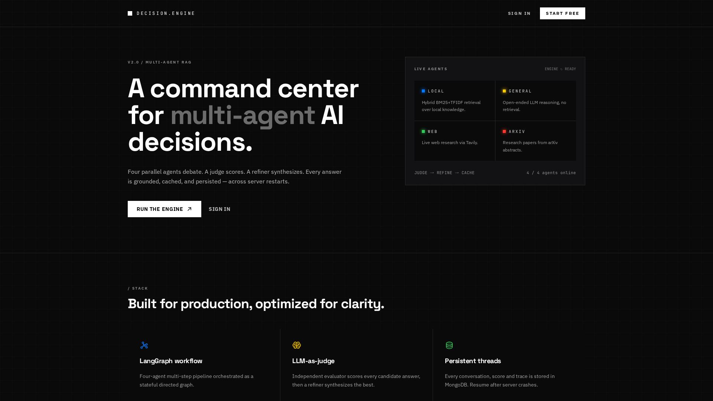
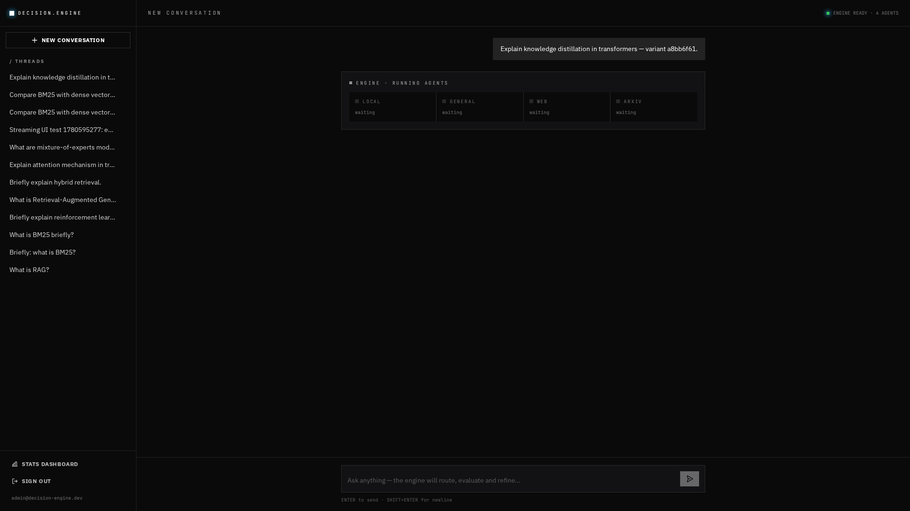
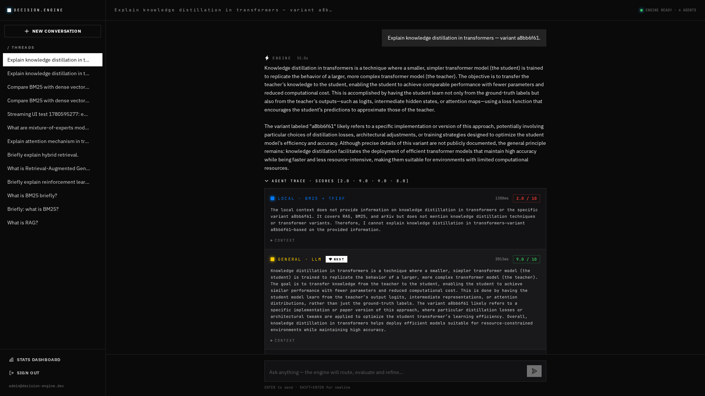
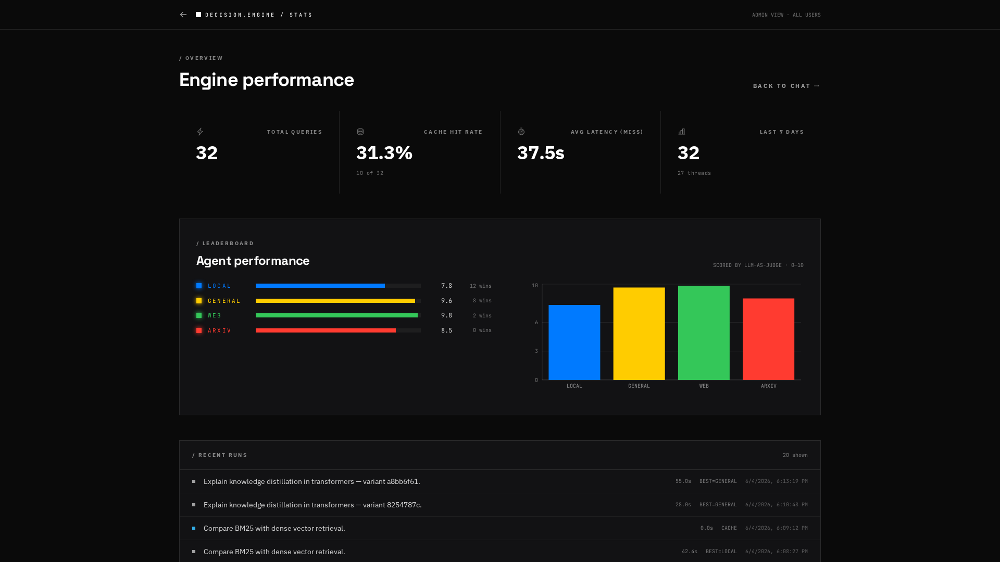
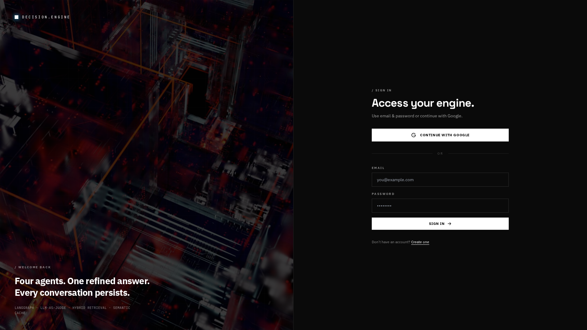

# 🧠 AI Mentor — Agentic RAG Platform

> A production-style, full-stack **AI Mentor** powered by multi-agent
> orchestration, hybrid retrieval (BM25 + FAISS), per-thread document
> intelligence (OCR + vision), persistent conversation memory, and
> evaluator-refiner answer synthesis.

[](https://multi-source-rag.preview.emergentagent.com)
[](.github/workflows/ci.yml)
[](.)
[](backend/tests)
[](#license)

---

## 🎬 Try it in 30 seconds

**Live demo →** [https://multi-source-rag.preview.emergentagent.com](https://multi-source-rag.preview.emergentagent.com)

```
Demo account
  email:    admin@decision-engine.dev
  password: admin123
```

Or click **Continue with Google** for one-click sign-in. Then:

1. **Drop a PDF / image into the chat** (drag-and-drop or paste).
2. **Ask a question about your file.**
3. Watch **5 agents** light up in parallel, see judge scores arrive, then the
   refined answer stream in token-by-token — grounded in your document.

> 💡 **Recruiter-friendly:** No setup, no clone. Click → sign in → drop a file
> → ask a question. The entire agentic pipeline runs end-to-end in seconds.

---

## ✨ Why this project

A single LLM call is fragile: it hallucinates, can't see your files, and
misses anything outside its training set. **AI Mentor** solves all three:

- **Multi-agent orchestration** — 4 global agents debate every question
  (Knowledge Base, General LLM, Live Web, arXiv Research). When you upload
  files, a **5th `thread_files` agent** is activated dynamically.
- **Real document intelligence** — Drop PDFs (native or scanned), text files,
  or images. Tesseract OCR, vision LLM, and chunking happen automatically.
- **Hybrid retrieval that survives restarts** — BM25 + FAISS (fastembed)
  fused via Reciprocal Rank Fusion, with **persistent indices on disk**
  auto-rebuilt from MongoDB if missing. Users never re-upload.
- **Conversation memory** — A rolling LLM summary plus the last-5 messages
  is composed into every agent prompt, so the engine knows the whole
  conversation, not just the last turn.
- **Everything streams** — Server-Sent Events deliver agent state, judge
  scores, and refined tokens in real time. No 30-second spinners.

---

## 📸 In action

### 1. Hero — five live agents, ready to ground in your files


### 2. Streaming engine — agents finish one by one, in real time
The screenshot below was captured **mid-query**. `KB` has completed, the
others are still thinking. The cursor caret pulses below as refined tokens
stream in — no spinners.



### 3. Agent trace — every candidate, every score, fully transparent
Each agent's raw answer, latency, and 0–10 judge score is one click away.
The highest-scoring agent gets a `BEST` badge. The refiner picks from here.



### 4. Stats dashboard — per-agent leaderboard, cache hit rate, recent runs
The engine's own self-reported performance — measured by its own judge.



### 5. Sign-in — JWT + one-click Google, unified user model


> 🔄 **Regenerate screenshots anytime:** `python scripts/capture_screenshots.py`
> (Playwright; works against live demo or local instance).

---

## 🏗️ Architecture

```
            ┌──────────────────────────────────────────────────────┐
            │  React 18 · Tailwind · Phosphor · Recharts           │
            │   ▸ Chat UI + thread sidebar (persistent)            │
            │   ▸ Drag-drop · Paste-image · Voice STT/TTS          │
            │   ▸ Live agent trace + score panel                   │
            │   ▸ Stats / dashboard                                │
            └──────────────────────┬───────────────────────────────┘
                                   │ JSON · SSE · httpOnly cookies
                                   ▼
            ┌──────────────────────────────────────────────────────┐
            │  FastAPI  (uvicorn · /api prefix · /docs)            │
            │   ▸ JWT + Emergent Google OAuth                      │
            │   ▸ Brute-force protection · CORS                    │
            └──────────────────────┬───────────────────────────────┘
                                   │
       ┌──────────────────┬────────┴────────┬───────────────────┐
       ▼                  ▼                 ▼                   ▼
┌────────────────┐ ┌───────────────┐ ┌──────────────┐  ┌────────────────┐
│ Agent pipeline │ │ Retrieval     │ │ Persistence  │  │ Emergent LLM   │
│  ▸ cache check │ │  ▸ Global KB  │ │  ▸ MongoDB   │  │  (gpt-4.1-mini │
│  ▸ load memory │ │    BM25+TFIDF │ │     - users  │  │   · gpt-4o     │
│  ▸ fan-out 5   │ │  ▸ Per-thread │ │     - threads│  │   for vision)  │
│    agents      │ │    BM25+FAISS │ │     - msgs   │  └────────────────┘
│  ▸ LLM judge   │ │    via RRF    │ │     - chunks │
│  ▸ refiner     │ │  ▸ Web (Tavily│ │     - summary│
│  ▸ summarize   │ │    /Brave)    │ │  ▸ FAISS     │
│    every 10 msg│ │  ▸ arXiv      │ │    on disk   │
└────────────────┘ └───────────────┘ └──────────────┘
```

### The 5 agents

| Color | Agent              | Source                                                      | Activates when…             |
|-------|--------------------|-------------------------------------------------------------|------------------------------|
| 🔵    | `local_retrieval`  | Built-in KB · BM25 + TF-IDF cosine (hybrid)                 | Always                       |
| 🟡    | `general_llm`      | LLM parametric knowledge                                    | Always                       |
| 🟢    | `tavily_web`       | Live Tavily web search                                      | Always (skipped if no key)   |
| 🔴    | `arxiv_research`   | arXiv abstract search                                       | Always                       |
| 🟣    | `thread_files`     | **User's uploaded docs** · BM25 + FAISS + RRF fusion        | Thread has uploaded files    |

A **judge** (LLM-as-a-judge) scores each candidate 0–10 on correctness,
relevance, clarity, and grounding. The highest-scoring answer flows into the
**refiner**, which produces the user-facing final answer.

> ⚙️ **Hard override:** when `thread_files` answer cites a filename or quotes
> a token that appears in any uploaded chunk, its score is boosted to ≥ 9.5.
> This corrects for LLM-judge bias against revealing user-owned content.

### Document intelligence pipeline

```
        ┌────────────────────────────────────────────────────┐
upload  │  PDF  ─►  pypdf text per page                       │
  ─►    │           │                                          │
        │           └─► [if <30 chars]  pdf2image + Tesseract │
        │                                                      │
        │  Image ─►  PIL normalize ─► Tesseract OCR (parallel) │
        │                       └───► gpt-4o vision describe   │
        │                                                      │
        │  Text  ─►  utf decode                                 │
        └─────────────┬──────────────────────────────────────┘
                      │
                      ▼
              Page-aware chunks  ─►  MongoDB.thread_documents
                      │
                      ▼
              fastembed BAAI/bge-small-en-v1.5 (ONNX, 384-d)
                      │
                      ▼
            FAISS IndexFlatIP  ─►  /app/data/faiss/<thread>.index
```

### Conversation memory

Every turn composes a three-tier context for each agent:

1. **Long-term** — rolling LLM summary (regenerated every 10 messages,
   delta-counter ensures boundaries aren't skipped through cache hits)
2. **Short-term** — last 5 messages
3. **Document** — top-K hybrid-retrieved chunks (from `thread_files` agent)

### Semantic cache

Refined answers are embedded (TF-IDF) and indexed per user. Semantically
similar repeats (cosine ≥ 0.72) return cached answers in ~10 ms.

> ⚙️ **Cache is skipped when the thread has uploads** — grounded answers are
> per-thread by nature and must not pollute cross-thread cache.

---

## 📦 Project structure

```
.
├── backend/
│   ├── server.py              # FastAPI app, CORS, startup, /api/health
│   ├── db.py                  # Motor client + index creation
│   ├── auth/                  # JWT + Emergent Google OAuth
│   ├── agents/
│   │   ├── graph.py           # LangGraph workflow (non-streaming)
│   │   ├── retrieval.py       # Global KB: BM25 + TF-IDF hybrid
│   │   ├── cache.py           # MongoDB-backed semantic cache
│   │   ├── external.py        # Tavily + arXiv helpers
│   │   └── llm.py             # emergentintegrations LlmChat wrapper
│   ├── chat/
│   │   ├── routes.py          # /api/threads CRUD
│   │   └── stream.py          # /api/ask/stream (SSE) — 5-agent pipeline
│   ├── uploads/
│   │   ├── extractors.py      # PDF (text + OCR), text, image (vision + OCR)
│   │   ├── retriever.py       # Per-thread BM25 + FAISS hybrid via RRF
│   │   └── routes.py          # POST/GET/DELETE /api/uploads + /summarize
│   ├── vectorstore/__init__.py # FAISS persistence (fastembed embeddings)
│   ├── memory/__init__.py     # Rolling summary + short-term history
│   ├── stats/routes.py        # /api/stats/overview, /api/stats/recent
│   └── tests/                 # pytest: 26 integration tests
├── frontend/
│   ├── src/
│   │   ├── pages/             # Landing, Login, Register, Chat, Dashboard
│   │   ├── components/        # AgentTracePanel, LivePipeline
│   │   ├── context/           # AuthContext
│   │   └── lib/{api,sse}.js   # axios + SSE client
│   └── tailwind.config.js     # Custom dark theme
├── tests/                     # pytest smoke tests
├── docker-compose.yml         # mongo + backend + frontend
└── .github/workflows/ci.yml   # GitHub Actions CI
```

---

## 🚀 Quickstart (local)

### Prerequisites

- **Python 3.11+**
- **Node 20+** with yarn
- **MongoDB 6+** on `:27017`
- **System packages** (Linux/macOS):
  ```bash
  # Ubuntu/Debian
  sudo apt-get install -y tesseract-ocr poppler-utils

  # macOS
  brew install tesseract poppler
  ```

### Backend

```bash
cd backend
pip install -r requirements.txt
pip install emergentintegrations --extra-index-url https://d33sy5i8bnduwe.cloudfront.net/simple/
cp ../.env.example .env   # then edit
uvicorn server:app --host 0.0.0.0 --port 8001 --reload
```

### Frontend

```bash
cd frontend
yarn install
yarn start    # http://localhost:3000
```

### Docker (one command)

```bash
docker-compose up --build
# Frontend: http://localhost:3000
# Backend:  http://localhost:8001/docs
```

---

## 🔑 Environment

`backend/.env`:

| Variable             | Required | Description                                                  |
|----------------------|----------|--------------------------------------------------------------|
| `MONGO_URL`          | ✅       | MongoDB connection string                                    |
| `DB_NAME`            | ✅       | Mongo database name                                          |
| `EMERGENT_LLM_KEY`   | ✅       | Universal LLM key (OpenAI / Anthropic / Gemini compatible)   |
| `LLM_MODEL`          | ✅       | Default text model (e.g. `gpt-4.1-mini`)                     |
| `LLM_PROVIDER`       | ✅       | `openai` / `anthropic` / `gemini`                            |
| `VISION_MODEL`       | ❌       | Vision model, default `gpt-4o`                               |
| `VISION_PROVIDER`    | ❌       | Vision provider, default `openai`                            |
| `EMBED_MODEL`        | ❌       | fastembed model, default `BAAI/bge-small-en-v1.5`            |
| `FAISS_DIR`          | ❌       | FAISS index dir, default `/app/data/faiss`                   |
| `JWT_SECRET`         | ✅       | Long random hex string                                       |
| `ADMIN_EMAIL`        | ✅       | Seeded on first start                                        |
| `ADMIN_PASSWORD`     | ✅       | Seeded on first start                                        |
| `FRONTEND_URL`       | ✅       | Used for CORS                                                |
| `TAVILY_API_KEY`     | ❌       | Enables the live web agent. Skipped if blank.                |

`frontend/.env`:

| Variable                | Description                       |
|-------------------------|-----------------------------------|
| `REACT_APP_BACKEND_URL` | URL where the FastAPI app is served |

---

## 🔌 API

Interactive Swagger docs at **`/docs`** when the backend is running.

| Method | Path                                  | Description                                       |
|-------:|---------------------------------------|---------------------------------------------------|
| GET    | `/api/`                               | Service info                                      |
| GET    | `/api/health`                         | Health probe                                      |
| POST   | `/api/auth/register`                  | Email + password registration                     |
| POST   | `/api/auth/login`                     | Email + password login                            |
| POST   | `/api/auth/logout`                    | Clears cookies                                    |
| GET    | `/api/auth/me`                        | Current authenticated user                        |
| POST   | `/api/auth/google/session`            | Exchange Emergent OAuth `session_id` for cookie   |
| GET    | `/api/threads`                        | List user threads                                 |
| POST   | `/api/threads`                        | Create empty thread                               |
| GET    | `/api/threads/{id}`                   | Get thread + messages                             |
| DELETE | `/api/threads/{id}`                   | Delete thread + cascade (msgs, files, FAISS)      |
| POST   | `/api/ask`                            | Ask a question (non-streaming)                    |
| POST   | `/api/ask/stream`                     | **Streaming** ask via Server-Sent Events          |
| POST   | `/api/uploads`                        | Upload PDF / text / image (multipart)             |
| GET    | `/api/uploads?thread_id={}`           | List uploads for a thread                         |
| DELETE | `/api/uploads/{file_id}`              | Delete file + rebuild FAISS                       |
| POST   | `/api/uploads/{file_id}/summarize`    | Generate structured document summary              |
| GET    | `/api/stats/overview`                 | Aggregated metrics                                |
| GET    | `/api/stats/recent`                   | Last 20 runs                                      |

### SSE events from `/api/ask/stream`

| Event             | Payload                                                 |
|-------------------|---------------------------------------------------------|
| `thread`          | `{thread_id, is_new}`                                   |
| `cache_check`     | `{hit, similarity?, matched_question?, answer?}`        |
| `memory_loaded`   | `{has_summary, recent_messages}`                        |
| `uploads_used`    | `{file_count, matched_chunks}`                          |
| `agent_start`     | `{index, name, color}`                                  |
| `agent_complete`  | `{index, name, answer, elapsed_ms, color}`              |
| `judge_scores`    | `{scores, best_index}`                                  |
| `refine_token`    | `{delta}`                                               |
| `summary_updated` | `{summary}`                                             |
| `done`            | `{final_answer, traces, scores, best_index, ...}`       |

---

## 🎯 Resume bullet points

Use these on your CV — every claim is backed by code in this repo.

- Designed and built an **agentic AI mentor platform** (FastAPI · React ·
  MongoDB · FAISS · LangGraph) with **5 parallel agents**, LLM-as-a-judge
  evaluation, answer refinement, and a persistent semantic cache.
- Implemented **per-thread document intelligence** — PDF (native + OCR via
  Tesseract), text, and image (vision + OCR) ingestion → page-aware chunking
  → MongoDB persistence → **hybrid BM25 + FAISS retrieval fused via RRF**.
- **Persistent FAISS indices on disk** (`fastembed` ONNX embeddings, 384-d)
  with **automatic rebuild from MongoDB chunks** on cold start — users never
  have to re-upload.
- **Three-tier conversation memory** — rolling LLM-generated summary
  (regenerated every 10 messages with delta-counter robustness) + short-term
  last-5 messages + retrieved document chunks composed into every agent prompt.
- **Streamed end-to-end pipeline** over Server-Sent Events — clients watch
  each agent's state, receive judge scores in real time, and consume refined
  tokens as they are generated.
- **Dual authentication** — JWT (email+password) + Emergent Google OAuth
  sharing a unified user model, with httpOnly cookies, bcrypt, brute-force
  lockout, and password reset tokens.
- **Multimodal input** at the UI layer — drag-and-drop, paste-image,
  browser-native voice STT (Web Speech API), per-message read-aloud TTS.
- Shipped **CI** (pytest + frontend build), **Docker Compose**, **OpenAPI**
  docs, and a 26-test integration suite covering the entire SSE pipeline.

---

## 🧪 Testing

```bash
# Unit + integration tests (requires running backend)
cd backend
REACT_APP_BACKEND_URL=http://localhost:8001 \
  python -m pytest tests/ -v
```

Current coverage:

| Suite                              | Tests | What it covers                                                         |
|------------------------------------|------:|------------------------------------------------------------------------|
| `tests/test_retrieval.py`          | ~5   | Global KB BM25 + TF-IDF fusion logic                                    |
| `tests/test_api.py`                | ~5   | Auth, thread CRUD, stats endpoints                                      |
| `tests/test_uploads.py`            | ~10  | Upload PDF / text / image; chunking; OCR detection; FAISS persistence  |
| `tests/test_uploads_regression.py` | ~6   | Cache pollution prevention; thread_files agent best-pick; recovery     |
| `tests/test_mentor_v2.py`          | ~10  | Conversation memory, hybrid retrieval, summarize endpoint, voice stubs |

---

## 🛣️ Roadmap

- [x] **AI Mentor 2.0** (Jan 2026): OCR · FAISS · 5th agent · memory · voice · summarize
- [ ] Cross-encoder reranker (e.g. `bge-reranker-base`) on top of RRF
- [ ] Per-user token & cost tracking
- [ ] Rate-limiting middleware
- [ ] Trace export → markdown (one-click portfolio artifact)
- [ ] Connector ingestion (Notion, Google Drive)

---

## 📄 License

MIT — see [LICENSE](LICENSE) (add your name).

---

Built with care · FastAPI · MongoDB · React · Tailwind · LangGraph · FAISS · fastembed · Tesseract
